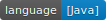

# algorithm

> since 2019-11-01 15:50

## Introduction

Data Structure &amp; Algorithm Problems' Solutions (LeetCode), implemented in Java, C, Python.

## LeetCode Algorithm

| No.  | Title                                                        | Desc                               | Solution                                                     | Difficulty | Tags                       |
| ---- | ------------------------------------------------------------ | ---------------------------------- | ------------------------------------------------------------ | ---------- | -------------------------- |
| 1    | [Two Sum](https://leetcode.com/problems/two-sum/)            | 求和为给定值的两个数               | [Java](./src/main/java/com/ywh/algorithm/leetcode/easy/LeetCode1.java) | Easy       | [数组] [哈希表] [双指针]   |
| 2    | [Add Two Numbers](https://leetcode.com/problems/add-two-numbers/) | 求两个单链表之和                   | [Java](./src/main/java/com/ywh/algorithm/leetcode/medium/LeetCode2.java) | Medium     | [链表] [数学]              |
| 3    | [Longest Substring Without Repeating Characters](https://leetcode.com/problems/longest-substring-without-repeating-characters/) | 没有重复字符的最长子串长度         | [Java](./src/main/java/com/ywh/algorithm/leetcode/medium/LeetCode3.java) | Medium     | [哈希表] [双指针] [字符串] |
| 4    | [Median of Two Sorted Arrays](https://leetcode.com/problems/median-of-two-sorted-arrays/) | 求两个有序数组的中位数             | [Java](./src/main/java/com/ywh/algorithm/leetcode/hard/LeetCode4.java) | Hard       | [数组] [二分搜索] [分治]   |
| 5    | [Longest Palindromic Substring](https://leetcode.com/problems/longest-palindromic-substring/) | 最长回文子串                       | [Java](./src/main/java/com/ywh/algorithm/leetcode/medium/LeetCode5.java) | Medium     | [字符串] [动态规划]        |
| 8    | [String to Integer (atoi)](https://leetcode.com/problems/string-to-integer-atoi/) | 字符串转整数                       | [Java](./src/main/java/com/ywh/algorithm/leetcode/medium/LeetCode8.java) | Medium     | [数学] [字符串]            |
| 9    | [Palindrome Number](https://leetcode.com/problems/palindrome-number/) | 回文数字判断                       | [Java](./src/main/java/com/ywh/algorithm/leetcode/easy/LeetCode9.java) | Easy       | [数学] [双指针]            |
| 11   | [Container With Most Water](https://leetcode.com/problems/container-with-most-water/) | 容纳最多水的凹槽容量               | [Java](./src/main/java/com/ywh/algorithm/leetcode/medium/LeetCode11.java) | Medium     | [数组] [双指针]            |
| 15   | [3Sum](https://leetcode.com/problems/3sum/)                  | 相加等于 0 的三个数                | [Java](./src/main/java/com/ywh/algorithm/leetcode/medium/LeetCode15.java) | Medium     | [数组] [双指针]            |
| 19   | [Remove Nth Node From End of List](https://leetcode.com/problems/remove-nth-node-from-end-of-list/) | 移除单链表倒数第 n 个节点          | [Java](./src/main/java/com/ywh/algorithm/leetcode/medium/LeetCode19.java) | Easy       | [链表] [双指针]            |
| 20   | [Valid Parentheses](https://leetcode.com/problems/valid-parentheses/) | 有效的括号序列                     | [Java](./src/main/java/com/ywh/algorithm/leetcode/easy/LeetCode20.java) | Easy       | [字符串] [栈]              |
| 21   | [Merge Two Sorted Lists](https://leetcode.com/problems/merge-two-sorted-lists/) | 合并两个有序链表                   | [Java](./src/main/java/com/ywh/algorithm/leetcode/easy/LeetCode21.java) | Easy       | [链表]                     |
| 22   | [Generate Parentheses](https://leetcode.com/problems/generate-parentheses/) | 括号的合法排列                     | [Java](./src/main/java/com/ywh/algorithm/leetcode/medium/LeetCode22.java) | Medium     | [字符串] [回溯]            |
| 28   | [Implement strStr()](https://leetcode.com/problems/implement-strstr/) | 实现 strstr                        | [Java](./src/main/java/com/ywh/algorithm/leetcode/easy/LeetCode28.java) | Easy       | [双指针] [字符串]          |
| 35   | [Search Insert Position](https://leetcode.com/problems/search-insert-position/) | 二分搜索插入位置                   | [Java](./src/main/java/com/ywh/algorithm/leetcode/medium/LeetCode35.java) | Medium     | [二分搜索]                 |
| 44   | [Wildcard Matching](https://leetcode.com/problems/wildcard-matching/) | 检验二叉搜索树                     | [Java](./src/main/java/com/ywh/algorithm/leetcode/hard/LeetCode44.java) | Hard       | [树] [DFS]                 |
| 46   | [Permutations](https://leetcode.com/problems/permutations/)  | 数组的全排列                       | [Java](./src/main/java/com/ywh/algorithm/leetcode/medium/LeetCode46.java) | Medium     | [回溯]                     |
| 49   | [Group Anagrams](https://leetcode.com/problems/anagrams/)    | 变位词分组                         | [Java](./src/main/java/com/ywh/algorithm/leetcode/medium/LeetCode49.java) | Medium     | [哈希表] [字符串]          |
| 50   | [Pow(x, n)](https://leetcode.com/problems/powx-n/)           | 数值的 n 次方                      | [Java](./src/main/java/com/ywh/algorithm/leetcode/medium/LeetCode50.java) | Medium     | [数学] [二分搜索]          |
| 53   | [Maximum Subarray](https://leetcode.com/problems/maximum-subarray/) | 连续子序列的最大和                 | [Java](./src/main/java/com/ywh/algorithm/leetcode/medium/LeetCode53.java) | Medium     | [动态规划] [分治] [数组]   |
| 56   | [Merge Intervals](https://leetcode.com/problems/merge-intervals/) | 区间合并                           | [Java](./src/main/java/com/ywh/algorithm/leetcode/hard/LeetCode56.java) | Hard       | [数组] [排序]              |
| 61   | [Rotate List](https://leetcode.com/problems/rotate-list/)    | 旋转单链表                         | [Java](./src/main/java/com/ywh/algorithm/leetcode/medium/LeetCode61.java) | Medium     | [链表]                     |
| 64   | [Minimum Path Sum](https://leetcode.com/problems/minimum-path-sum/) | 最小路径和                         | [Java](./src/main/java/com/ywh/algorithm/leetcode/medium/LeetCode64.java) | Medium     | [数组] [动态规划]          |
| 69   | [Sqrt(x)](https://leetcode.com/problems/sqrtx/)              | 实现平方根函数                     | [Java](./src/main/java/com/ywh/algorithm/leetcode/medium/LeetCode69.java) | Medium     | [数学] [二分搜索]          |
| 70   | [Climbing Stairs](https://leetcode.com/problems/climbing-stairs/) | 爬楼梯方法数                       | [Java](./src/main/java/com/ywh/algorithm/leetcode/easy/LeetCode70.java) | Easy       | [动态规划]                 |
| 72   | [Edit Distance](https://leetcode.com/problems/edit-distance/) | 编辑距离                           | [Java](./src/main/java/com/ywh/algorithm/leetcode/hard/LeetCode72.java) | Hard       | [字符串] [动态规划]        |
| 73   | [Set Matrix Zeroes](https://leetcode.com/problems/set-matrix-zeroes/) | 矩阵置零                           | [Java](./src/main/java/com/ywh/algorithm/leetcode/medium/LeetCode73.java) | Medium     | [数组]                     |
| 74   | [Search a 2D Matrix](https://leetcode.com/problems/search-a-2d-matrix/) | 二维数组的二分搜索                 | [Java](./src/main/java/com/ywh/algorithm/leetcode/medium/LeetCode74.java) | Medium     | [数组] [二分搜索]          |
| 75   | [Sort Colors](https://leetcode.com/problems/sort-colors/)    | 荷兰国旗问题                       | [Java](./src/main/java/com/ywh/algorithm/leetcode/medium/LeetCode75.java) | Medium     | [数组] [双指针] [排序]     |
| 79   | [Word Search](https://leetcode.com/problems/word-search/)    | 搜索单词                           | [Java](./src/main/java/com/ywh/algorithm/leetcode/medium/LeetCode79.java) | Medium     | [数组] [回溯] [DFS]        |
| 82   | [Remove Duplicates from Sorted List II](https://leetcode.com/problems/remove-duplicates-from-sorted-list-ii/) | 有序链表删除重复节点               | [Java](./src/main/java/com/ywh/algorithm/leetcode/medium/LeetCode82.java) | Medium     | [链表]                     |
| 83   | [Remove Duplicates from Sorted List](https://leetcode.com/problems/remove-duplicates-from-sorted-list/) | 有序链表去重                       | [Java](./src/main/java/com/ywh/algorithm/leetcode/easy/LeetCode83.java) | Easy       | [链表]                     |
| 86   | [Partition List](https://leetcode.com/problems/partition-list/) | 链表划分                           | [Java](./src/main/java/com/ywh/algorithm/leetcode/medium/LeetCode86.java) | Medium     | [链表] [双指针]            |
| 88   | [Merge Sorted Array](https://leetcode.com/problems/merge-sorted-array/) | 合并两个有序数组                   | [Java](./src/main/java/com/ywh/algorithm/leetcode/easy/LeetCode88.java) | Easy       | [双指针] [数组]            |
| 94   | [Binary Tree Inorder Traversal](https://leetcode.com/problems/binary-tree-inorder-traversal/) | 二叉树中序遍历                     | [Java](./src/main/java/com/ywh/algorithm/leetcode/medium/LeetCode94.java) | Medium     | [哈希表] [栈] [树]         |
| 100  | [Same Tree](https://leetcode.com/problems/same-tree/)        | 判断二叉树是否相同                 | [Java](./src/main/java/com/ywh/algorithm/leetcode/easy/LeetCode100.java) | Easy       | [树] [栈]                  |
| 101  | [Symmetric Tree](https://leetcode.com/problems/symmetric-tree/) | 判断二叉树是否对称                 | [Java](./src/main/java/com/ywh/algorithm/leetcode/easy/LeetCode101.java) | Easy       | [树] [DFS] [BFS]           |
| 102  | [Binary Tree Level Order Traversal](https://leetcode.com/problems/binary-tree-level-order-traversal/) | 二叉树的层序遍历                   | [Java](./src/main/java/com/ywh/algorithm/leetcode/easy/LeetCode102.java) | Easy       | [树] [BFS]                 |
| 104  | [Maximum Depth of Binary Tree](https://leetcode.com/problems/maximum-depth-of-binary-tree/) | 二叉树的最大深度                   | [Java](./src/main/java/com/ywh/algorithm/leetcode/easy/LeetCode104.java) | Easy       | [树] [DFS]                 |
| 107  | [Binary Tree Level Order Traversal II](https://leetcode.com/problems/binary-tree-level-order-traversal-ii/) | 求和为给定值的两个数               | [Java](./src/main/java/com/ywh/algorithm/leetcode/easy/LeetCode1.java) | Easy       | [数组] [哈希表] [双指针]   |
| 108  | [Convert Sorted Array to Binary Search Tree](https://leetcode.com/problems/convert-sorted-array-to-binary-search-tree/) | 用有序数组构建二叉搜索树           | [Java](./src/main/java/com/ywh/algorithm/leetcode/medium/LeetCode108.java) | Medium     | [树] [DFS]                 |
| 110  | [Balanced Binary Tree](https://leetcode.com/problems/balanced-binary-tree/) | 判断二叉树是否平衡                 | [Java](./src/main/java/com/ywh/algorithm/leetcode/easy/LeetCode110.java) | Easy       | [树] [DFS]                 |
| 111  | [Minimum Depth of Binary Tree](https://leetcode.com/problems/minimum-depth-of-binary-tree/) | 二叉树的最小深度                   | [Java](./src/main/java/com/ywh/algorithm/leetcode/easy/LeetCode111.java) | Easy       | [树] [DFS] [BFS]           |
| 112  | [Path Sum](https://leetcode.com/problems/path-sum/)          | 路径和是否等于给定值               | [Java](./src/main/java/com/ywh/algorithm/leetcode/easy/LeetCode112.java) | Easy       | [树] [DFS]                 |
| 118  | [Pascal's Triangle](https://leetcode.com/problems/pascals-triangle/) | 帕斯卡三角形                       | [Java](./src/main/java/com/ywh/algorithm/leetcode/easy/LeetCode118.java) | Easy       | [数组]                     |
| 121  | [Best Time to Buy and Sell Stock](https://leetcode.com/problems/best-time-to-buy-and-sell-stock/) | 买卖股票的最大利润                 | [Java](./src/main/java/com/ywh/algorithm/leetcode/medium/LeetCode121.java) | Medium     | [数组] [动态规划]          |
| 125  | [Valid Palindrome](https://leetcode.com/problems/valid-palindrome/) | 回文字符串判断                     | [Java](./src/main/java/com/ywh/algorithm/leetcode/easy/LeetCode125.java) | Easy       | [双指针] [字符串]          |
| 136  | [Single Number](https://leetcode.com/problems/single-number/) | 单身数字                           | [Java](./src/main/java/com/ywh/algorithm/leetcode/medium/LeetCode136.java) | Medium     | [哈希表] [位操作]          |
| 141  | [Linked List Cycle](https://leetcode.com/problems/linked-list-cycle/) | 判断单链表是否有环                 | [Java](./src/main/java/com/ywh/algorithm/leetcode/medium/LeetCode141.java) | Medium     | [链表] [双指针]            |
| 142  | [Linked List Cycle II](https://leetcode.com/problems/linked-list-cycle-ii/) | 单链表中圆环的开始节点             | [Java](./src/main/java/com/ywh/algorithm/leetcode/medium/LeetCode142.java) | Medium     | [链表] [双指针]            |
| 144  | [Binary Tree Preorder Traversal](https://leetcode.com/problems/binary-tree-preorder-traversal/) | 二叉树前序遍历                     | [Java](./src/main/java/com/ywh/algorithm/leetcode/medium/LeetCode144.java) | Medium     | [栈] [树]                  |
| 146  | [LRU Cache](https://leetcode.com/problems/lru-cache/)        | 实现 LRU 缓存                      | [Java](./src/main/java/com/ywh/algorithm/leetcode/hard/LeetCode146.java) | Hard       | [设计]                     |
| 148  | [Sort List](https://leetcode.com/problems/sort-list/)        | 单链表排序                         | [Java](./src/main/java/com/ywh/algorithm/leetcode/medium/LeetCode148.java) | Medium     | [链表] [排序]              |
| 155  | [Min Stack](https://leetcode.com/problems/min-stack/)        | 带有 min 函数的栈带有 min 函数的栈 | [Java](./src/main/java/com/ywh/algorithm/leetcode/easy/LeetCode155.java) | Easy       | [栈] [设计]                |
| 160  | [Intersection of Two Linked Lists](https://leetcode.com/problems/intersection-of-two-linked-lists/) | 链表的相交节点                     | [Java](./src/main/java/com/ywh/algorithm/leetcode/easy/LeetCode160.java) | Easy       | [链表]                     |
| 167  | [Two Sum II - Input array is sorted](https://leetcode.com/problems/two-sum-ii-input-array-is-sorted/) | 有序数组中求和为给定值的两个数     | [Java](./src/main/java/com/ywh/algorithm/leetcode/medium/LeetCode167.java) | Medium     | [双指针] [数组] [二分搜索] |
| 169  | [Majority Element](https://leetcode.com/problems/majority-element/) | 数组中超过一半的数字               | [Java](./src/main/java/com/ywh/algorithm/leetcode/easy/LeetCode169.java) | Easy       | [数组] [分治] [位操作]     |
| 189  | [Rotate Array](https://leetcode.com/problems/rotate-array/)  | 旋转数组                           | [Java](./src/main/java/com/ywh/algorithm/leetcode/easy/LeetCode189.java) | Easy       | [数组]                     |
| 191  | [Number of 1 Bits](https://leetcode.com/problems/number-of-1-bits/) | 二进制中 1 的个数                  | [Java](./src/main/java/com/ywh/algorithm/leetcode/easy/LeetCode191.java) | Easy       | [位操作]                   |
| 198  | [House Robber](https://leetcode.com/problems/house-robber/)  | 抢劫连排房子                       | [Java](./src/main/java/com/ywh/algorithm/leetcode/easy/LeetCode198.java) | Easy       | [动态规划]                 |
| 203  | [Remove Linked List Elements](https://leetcode.com/problems/remove-linked-list-elements/) | 单链表删除数字                     | [Java](./src/main/java/com/ywh/algorithm/leetcode/easy/LeetCode203.java) | Easy       | [链表]                     |
| 206  | [Reverse Linked List](https://leetcode.com/problems/reverse-linked-list/) | 反转单链表                         | [Java](./src/main/java/com/ywh/algorithm/leetcode/easy/LeetCode206.java) | Easy       | [链表]                     |
| 215  | [Kth Largest Element in an Array](https://leetcode.com/problems/kth-largest-element-in-an-array/) | 数组中第 K 大的元素                | [Java](./src/main/java/com/ywh/algorithm/leetcode/medium/LeetCode215.java) | Medium     | [分治] [堆]                |
| 226  | [Invert Binary Tree](https://leetcode.com/problems/invert-binary-tree/) | 翻转二叉树                         | [Java](./src/main/java/com/ywh/algorithm/leetcode/easy/LeetCode226.java) | Easy       | [树]                       |
| 232  | [Implement Queue using Stacks](https://leetcode.com/problems/implement-queue-using-stacks/) | 使用栈实现队列                     | [Java](./src/main/java/com/ywh/algorithm/leetcode/easy/LeetCode232.java) | Easy       | [栈] [设计]                |
| 234  | [Palindrome Linked List](https://leetcode.com/problems/palindrome-linked-list/) | 判断单链表是否为回文链表           | [Java](./src/main/java/com/ywh/algorithm/leetcode/easy/LeetCode234.java) | Easy       | [链表] [双指针]            |
| 237  | [Delete Node in a Linked List](https://leetcode.com/problems/delete-node-in-a-linked-list/) | 删除链表节点                       | [Java](./src/main/java/com/ywh/algorithm/leetcode/easy/LeetCode237.java) | Easy       | [链表]                     |
| 240  | [Search a 2D Matrix II](https://leetcode.com/problems/search-a-2d-matrix-ii/) | 行列递增的二维数组搜索             | [Java](./src/main/java/com/ywh/algorithm/leetcode/medium/LeetCode240.java) | Medium     | 行列递增的二维数组搜索     |
| 263  | [Ugly Number](https://leetcode.com/problems/ugly-number/)    | 丑数                               | [Java](./src/main/java/com/ywh/algorithm/leetcode/easy/LeetCode263.java) | Easy       | [数学]                     |
| 268  | [Missing Number](https://leetcode.com/problems/missing-number/) | 缺失的数字                         | [Java](./src/main/java/com/ywh/algorithm/leetcode/medium/LeetCode268.java) | Medium     | [数组] [数学] [位操作]     |
| 283  | [Move Zeroes](https://leetcode.com/problems/move-zeroes/)    | 向后移动 0                         | [Java](./src/main/java/com/ywh/algorithm/leetcode/easy/LeetCode283.java) | Easy       | [数组] [双指针]            |
| 344  | [Reverse String](https://leetcode.com/problems/reverse-string/) | 反转字符串                         | [Java](./src/main/java/com/ywh/algorithm/leetcode/easy/LeetCode344.java) | Easy       | [字符串] [双指针]          |
| 371  | [Sum of Two Integers](https://leetcode.com/problems/sum-of-two-integers/description/) | 不用 +/- 求两数之和                | [Java](./src/main/java/com/ywh/algorithm/leetcode/easy/LeetCode371.java) | Easy       | [位操作]                   |
| 384  | [Shuffle an Array](https://leetcode.com/problems/shuffle-an-array/) | 随机洗牌                           | [Java](./src/main/java/com/ywh/algorithm/leetcode/medium/LeetCode384.java) | Medium     | [数组]                     |
| 387  | [First Unique Character in a String](https://leetcode.com/problems/first-unique-character-in-a-string/) | 第一个只出现一次的字符             | [Java](./src/main/java/com/ywh/algorithm/leetcode/easy/LeetCode387.java) | Easy       | [字符串] [哈希表]          |
| 409  | [Longest Palindrome](https://leetcode.com/problems/longest-palindrome/) | 最长回文串的长度                   | [Java](./src/main/java/com/ywh/algorithm/leetcode/easy/LeetCode409.java) | Easy       | [哈希表]                   |
| 461  | [Hamming Distance](https://leetcode.com/problems/hamming-distance/) | 汉明距离                           | [Java](./src/main/java/com/ywh/algorithm/leetcode/easy/LeetCode461.java) | Easy       | [位操作]                   |
| 509  | [Fibonacci Number](https://leetcode.com/problems/fibonacci-number) | 第 n 个斐波那契数                  | [Java](./src/main/java/com/ywh/algorithm/leetcode/easy/LeetCode509.java) | Easy       | [数组] [动态规划]          |
| 518  | [Coin Change 2](https://leetcode.com/problems/coin-change-2) | 硬币面值组合问题                   | [Java](./src/main/java/com/ywh/algorithm/leetcode/medium/LeetCode518.java) | Medium     |                            |
| 540  | [Single Element in a Sorted Array](https://leetcode.com/problems/single-element-in-a-sorted-array) | 有序数组中的单身数字               | [Java](./src/main/java/com/ywh/algorithm/leetcode/medium/LeetCode540.java) | Medium     | [位操作] [二分搜索]        |
| 557  | [Reverse Words in a String III](https://leetcode.com/problems/reverse-words-in-a-string-iii) | 反转单词                           | [Java](./src/main/java/com/ywh/algorithm/leetcode/easy/LeetCode557.java) | Easy       | [字符串]                   |
| 572  | [Subtree of Another Tree](https://leetcode.com/problems/subtree-of-another-tree) | 树 t 是否等于树 s 的子树           | [Java](./src/main/java/com/ywh/algorithm/leetcode/easy/LeetCode572.java) | Easy       | [树]                       |
| 617  | [Merge Two Binary Trees](https://leetcode.com/problems/merge-two-binary-trees) | 合并二叉树                         | [Java](./src/main/java/com/ywh/algorithm/leetcode/easy/LeetCode617.java) | Easy       | [树]                       |
| 647  | [Palindromic Substrings](https://leetcode.com/problems/palindromic-substrings) | 回文子串个数                       | [Java](./src/main/java/com/ywh/algorithm/leetcode/medium/LeetCode647.java) | Medium     | [字符串] [动态规划]        |
| 700  | [Search in a Binary Search Tree](https://leetcode.com/problems/search-in-a-binary-search-tree) | 二叉搜索树中查找数字               | [Java](./src/main/java/com/ywh/algorithm/leetcode/easy/LeetCode700.java) | Easy       | [树]                       |
| 703  | [Kth Largest Element in a Stream](https://leetcode.com/problems/kth-largest-element-in-a-stream) | 数据流中第 K 大的元素              | [Java](./src/main/java/com/ywh/algorithm/leetcode/easy/LeetCode703.java) | Easy       | [堆]                       |
| 704  | [Binary Search](https://leetcode.com/problems/binary-search) | 二分搜索                           | [Java](./src/main/java/com/ywh/algorithm/leetcode/easy/LeetCode704.java) | Easy       | [二分搜索]                 |
| 746  | [Min Cost Climbing Stairs](https://leetcode.com/problems/min-cost-climbing-stairs) | 爬楼梯的最小代价                   | [Java](./src/main/java/com/ywh/algorithm/leetcode/easy/LeetCode746.java) | Easy       | [数组] [动态规划]          |
| 771  | [Jewels and Stones](https://leetcode.com/problems/jewels-and-stones) | 石头中的珠宝数量                   | [Java](./src/main/java/com/ywh/algorithm/leetcode/easy/LeetCode771.java) | Easy       | [哈希表]                   |
| 876  | [Middle of the Linked List](https://leetcode.com/problems/middle-of-the-linked-list) | 单链表中间节点                     | [Java](./src/main/java/com/ywh/algorithm/leetcode/easy/LeetCode876.java) | Easy       | [链表]                     |

> Solutions implemented in C, Python coming soon.
